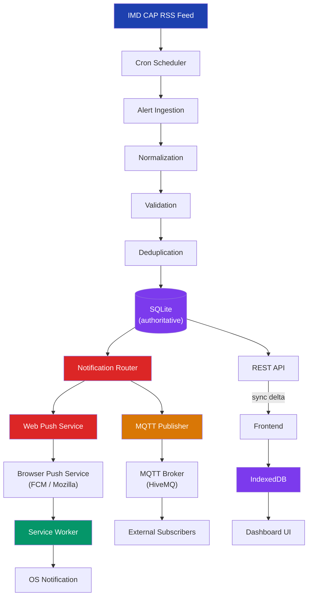

# WeatherGPT Alert System — Architecture

This document completely details the alerting pipeline architecture, spanning from IMD ingestion down to OS-level notifications and offline client caching.

## 1. System Architecture



## 2. Backend Architecture
The backend is a Node.js Express server with a bundled SQLite database. It is entirely authoritative; the frontend clients are thin clients that cache data locally but defer to the backend's revision log for truth.

## 3. Alert Ingestion Flow
1. **Fetch**: The scheduler polls the IMD RSS feed.
2. **Normalize**: CAP XML data is converted into a standard internal format.
3. **Deduplicate**: Alerts are matched by their `source_id`. If an alert already exists, it is evaluated for changes.
4. **Persist**: New or changed alerts increment the system `revision` and are written to SQLite.
5. **Route**: After persistence, alerts are passed to the `notificationRouter`.

## 4. MQTT Flow
MQTT serves strictly as a **real-time event propagation mechanism**, not a database. 
- The backend maintains a single persistent secure connection to the broker (HiveMQ).
- **Credentials** are stored in backend `.env` variables and never exposed to the frontend.
- When an alert is ingested, it is published to a targeted topic: `weathergpt/alerts/{state}/{district}`.
- If the severity is Extreme, it is published to `weathergpt/alerts/{state}/all`.

## 5. Web Push Flow
Web Push delivers **OS-level notifications** even if the WeatherGPT tab is closed.
- **Keys**: VAPID keys are generated once. Private key stays on server. Public key is requested by browser.
- **Registration**: Browser creates a `PushSubscription` and sends it to `/api/push/subscribe`, tied to a state/district.
- **Delivery**: The server filters subscriptions by state/district and pushes a compact payload (< 3 KB).
- **Service Worker**: The Service Worker wakes up, reads the payload, and displays the OS notification.

## 6. Location Targeting Flow
- Clients determine their state/district via browser geolocation (or manual fallback).
- This location is saved locally and registered with the server's push table.
- When an alert applies to `Dakshina Kannada, Karnataka`, only subscriptions registered to that district or state receive the push notification.
- Extreme alerts bypass location filters and are sent to all users.

## 7. Offline/Low-Network Synchronization Flow
- **Offline**: The Service Worker serves the application shell. IndexedDB provides previously downloaded alerts. The UI displays "Offline" and no network requests are attempted.
- **Low-Network**: If `networkProfile=slow` is detected, the API sync endpoint returns ultra-compact data containing only severity, event, and area (`{id, s, e, a, x}`).
- **Sync**: Synchronization is **revision-based**. The client passes its local `revision` (e.g., `since=498`) and receives only the delta of changes, avoiding expensive full-dataset downloads.

## 8. Notification Flow
```
IMD RSS → Ingestion → DB Persistence → Notification Router
  ├─> Web Push Service (fan-out by location) → Service Worker → OS Notification
  └─> MQTT Publisher (targeted topics) → External Subscriptions
```

## 9. Database / Data Flow
| Table | Purpose |
|-------|---------|
| `alerts` | Normalized alert records with indexes for fast querying. |
| `sync_state` | Monotonically increasing revision counter for delta syncs. |
| `provider_status` | Health tracking for IMD ingestion. |
| `push_subscriptions`| Endpoints, VAPID keys, and device locations for Web Push fan-out. |

## 10. Failure/Recovery Flow

### What happens when:
- **IMD is unavailable**: The ingestion cron logs a failure, sets health status to `degraded`, and retries next cycle. Existing valid alerts remain active. The system *never* fabricates fake fallback alerts.
- **MQTT is unavailable**: Ingestion continues. SQLite remains the source of truth. Publishing errors are caught and do not crash the pipeline.
- **Web Push is unavailable**: If a 410 (Gone) is returned by FCM/Mozilla, the subscription is permanently deleted. If transient (500), it's ignored for that cycle.
- **Browser is offline**: Shows cached data from IndexedDB. Displays "Offline" status flag.
- **Browser reconnects**: Fires a sync request with its last known `revision` to fetch missed updates.
- **Alert expires while client offline**: The backend marks it EXPIRED. When the client reconnects, the delta sync explicitly removes it from the active UI.
- **Client changes location**: The client registers the new state/district with `/api/push/subscribe`, seamlessly updating the server's routing table (upsert by endpoint).
- **Multiple alerts arrive at once**: They are batched processed. The revision increments sequentially. Deduplication prevents overlapping inserts.

## 11. Security
- All sensitive credentials (`VAPID_PRIVATE_KEY`, `MQTT_PASSWORD`) reside entirely in the backend environment.
- The Service Worker push event is the *only* component managing OS notifications. No polling happens in the main thread.
