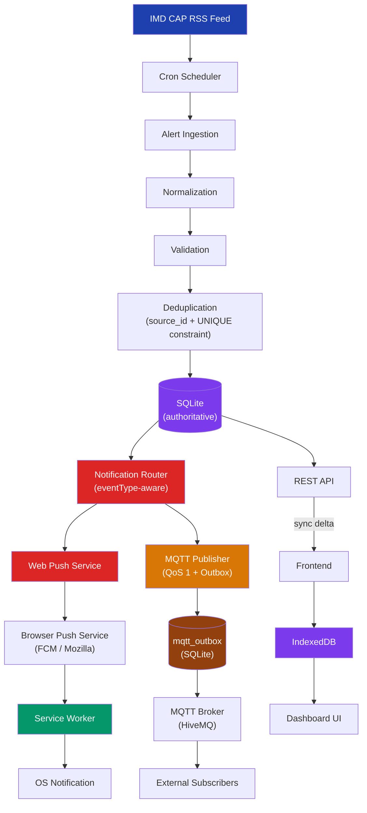

# WeatherGPT Alert System — Architecture

> **Note**: Multilingual translation and Read Aloud features are currently **OUT OF SCOPE** and have been removed from this architecture to maintain a stable, English-only baseline.

This document completely details the alerting pipeline architecture, spanning from IMD ingestion down to OS-level notifications and offline client caching.

## 1. System Architecture



## 2. Backend Architecture

The backend is a Node.js Express server with a bundled SQLite database. It is entirely authoritative; the frontend clients are thin clients that cache data locally but defer to the backend's revision log for truth.

## 3. Alert Identity

An alert is uniquely identified by the composite key `(source, source_id)`.

- `source` — the data provider (e.g. `imd`)
- `source_id` — the authoritative CAP `<identifier>` field from IMD

This is the **only** identity key used for deduplication. Alerts are never identified by title, description, timestamp, state, or district alone.

A `UNIQUE INDEX` on `alerts(source, source_id)` enforces this at the database level. The application-level check in `processAlerts()` provides a secondary guard and enables change detection before any DB write occurs.

## 4. Alert Lifecycle

```
NEW ALERT ARRIVES (source_id not in DB)
    ↓
status = ACTIVE
lifecycleEvent = alert_created
    ↓
SAME ALERT ARRIVES (no meaningful change)
    ↓
lifecycleEvent = alert_unchanged
→ No DB write. No revision increment. No notification sent.

SAME ALERT ARRIVES (meaningful change detected)
    ↓
status = ACTIVE (unchanged in DB for backward compat)
lifecycleEvent = alert_updated
→ revision incremented, notification sent

CAP msgType = Cancel received
    ↓
status = CANCELLED (existing alert record updated)
lifecycleEvent = alert_cancelled
→ revision incremented, cancellation notification sent
→ Alert record is PRESERVED (not deleted)

expires_at < now
    ↓
status = EXPIRED
lifecycleEvent = alert_expired
→ Recorded in alert_revisions with action='expired'
→ Delta sync propagates removal to clients
```

### Status Values (DB)
| Status | Meaning |
|--------|---------|
| `ACTIVE` | Alert is valid and currently in effect |
| `EXPIRED` | `expires_at` has passed; no longer in effect |
| `CANCELLED` | IMD explicitly cancelled via CAP `msgType=Cancel` |
| `UPDATED` | Reserved (future use; current pipeline uses ACTIVE + revision) |

### Lifecycle Event Types (routing/logging only — not stored in DB)
| Event | Trigger |
|-------|---------|
| `alert_created` | First time source_id is seen |
| `alert_updated` | Existing alert with meaningful field changes |
| `alert_unchanged` | Same source_id, no changes — no notification sent |
| `alert_expired` | Time-based expiry transition |
| `alert_cancelled` | CAP msgType=Cancel received from IMD |

## 5. Alert Versioning and Change Detection

`hasChanged()` compares all 12 user-observable fields:

| Field | Why |
|-------|-----|
| `severity` | Escalation (Minor→Extreme) must trigger re-notification |
| `urgency` | Changes urgency level for users |
| `certainty` | Changes confidence level |
| `status` | Expiry/cancellation state change |
| `event` | Alert category change |
| `headline` | Primary user-visible text |
| `description` | Alert body change |
| `instruction` | Action guidance change |
| `effectiveAt` | Alert start time change |
| `expiresAt` | Expiry extension from IMD must be treated as update |
| `area` | Geographic scope change |
| `polygon` | Precise area boundary change |

Timestamp noise (sub-second differences in `issuedAt`) does **not** trigger updates.

## 6. Alert Ingestion Flow

1. **Fetch**: The scheduler polls the IMD RSS feed.
2. **Per-alert normalization** (isolated): Each CAP alert is normalized individually. One malformed alert is logged and skipped; the rest continue.
3. **CAP msgType detection**: If `msgType=Cancel`, the referenced alert is marked `CANCELLED`. The cancel message is not stored as a new alert.
4. **Deduplicate**: Alerts are matched by `source_id`. If unchanged → skip. If changed → update. If new → create.
5. **Persist**: New or changed alerts increment `revision` and are written to SQLite via `INSERT OR IGNORE` (handles race conditions).
6. **Route**: After persistence, alerts are passed to the `notificationRouter` with a lifecycle event type.
7. **Expire**: `expireAlerts()` is called **only** after a successful provider fetch — never on failure.

## 7. MQTT Flow

MQTT serves strictly as a **real-time event propagation mechanism**, not a database.

- The backend maintains a single persistent secure connection to the broker (HiveMQ).
- **Credentials** are stored in backend `.env` variables and never exposed to the frontend.
- **QoS 1** (at-least-once delivery) is used for all alert publications.
- **Retained messages: disabled.** Retaining expired alerts for new subscribers is incorrect. Subscribers must sync via REST on connect.
- When an alert is ingested, it is published to a targeted topic: `weathergpt/alerts/{state}/{district}`.
- If the severity is Extreme, it is published to `weathergpt/alerts/{state}/all`.

### MQTT Reconnection

The `mqtt` library handles reconnection automatically via `reconnectPeriod` (default: 5 seconds). The `connect()` function includes an idempotency guard (`if (client) return`) to prevent multiple simultaneous connections. On every reconnect event, `flushOutbox()` is called automatically.

### MQTT Failure Handling

MQTT failure is **always non-fatal**. The pipeline order is:

```
IMD → DB write (authoritative) → MQTT publish (best-effort)
```

If MQTT publish fails (broker offline, timeout, etc.):
1. The message is written to `mqtt_outbox` (PENDING).
2. The alert remains safely stored in SQLite.
3. On reconnect (or every 2 minutes via scheduler), `flushOutbox()` publishes pending entries.
4. Each failed attempt increments `attempts`. After 10 failures, the entry is marked `FAILED`.

## 8. MQTT Outbox

The `mqtt_outbox` table provides persistent delivery guarantees:

```
Alert stored in DB
    ↓
MQTT unavailable
    ↓
enqueue() → status=PENDING
    ↓
MQTT reconnects (or 2-min scheduler fires)
    ↓
flushOutbox()
    ↓
publish at QoS 1
    ↓
markPublished() → status=PUBLISHED
```

**QoS 1 duplicate handling**: Because QoS 1 is at-least-once, subscribers may receive duplicate messages. Subscribers must deduplicate by `alertId` (present in every payload).

**Outbox is observable** (not user-facing): The `/api/health` endpoint exposes outbox stats (`pending`, `published`, `failed`) for future Admin Dashboard use.

## 9. Web Push Flow

Web Push delivers **OS-level notifications** even if the WeatherGPT tab is closed.

- **Keys**: VAPID keys are generated once. Private key stays on server. Public key is requested by browser.
- **Registration**: Browser creates a `PushSubscription` and sends it to `/api/push/subscribe`, tied to a state/district.
- **Delivery**: The server filters subscriptions by state/district and pushes a compact payload (< 3 KB).
- **Service Worker**: The Service Worker wakes up, reads the payload, and displays the OS notification.
- **410/404 cleanup**: If a push returns 410 (Gone) or 404, the subscription is permanently removed. No retry for invalid endpoints.
- **Transient failures**: Increments `failure_count`. High-failure subscriptions are surfaced via `/api/health` (not user dashboard).

## 10. Notification Deduplication

Notifications are only sent for `alert_created` and `alert_updated` events:

| Ingestion result | Notification sent? |
|-----------------|-------------------|
| New alert | ✅ `alert_created` |
| Meaningful change | ✅ `alert_updated` |
| Unchanged | ❌ No notification |
| Cancellation | ✅ `alert_cancelled` (if supported by channel) |
| Expiry | ❌ No push notification (sync removes from client) |

## 11. Location Targeting Flow

- Clients determine their state/district via browser geolocation (or manual fallback).
- This location is saved locally and registered with the server's push table.
- When an alert applies to `Dakshina Kannada, Karnataka`, only subscriptions registered to that district or state receive the push notification.
- Extreme alerts bypass location filters and are sent to all users.

## 12. Offline/Low-Network Synchronization Flow

- **Offline**: The Service Worker serves the application shell. IndexedDB provides previously downloaded alerts. The UI displays "Offline" and no network requests are attempted.
- **Low-Network**: If `networkProfile=slow` is detected, the API sync endpoint returns ultra-compact data containing only severity, event, and area (`{id, s, e, a, x}`).
- **Sync**: Synchronization is **revision-based**. The client passes its local `revision` (e.g., `since=498`) and receives only the delta of changes, avoiding expensive full-dataset downloads.
- **Expiry propagation**: When an alert expires, its ID appears in `removed[]` in the sync response, prompting clients to remove it from IndexedDB.

## 13. Database / Data Flow

| Table | Purpose |
|-------|---------|
| `alerts` | Normalized alert records. UNIQUE(source, source_id) enforces deduplication. |
| `alert_revisions` | Per-alert history: created, updated, expired, cancelled actions with diffs. |
| `sync_state` | Monotonically increasing global revision counter for delta syncs. |
| `provider_status` | IMD ingestion health tracking (failures, success timestamps). |
| `push_subscriptions` | Endpoints, VAPID keys, device locations for Web Push fan-out. |
| `delivery_queue` | Per-device alert delivery queue for pull-based sync. |
| `devices` | Registered device records with state/district. |
| `mqtt_outbox` | Persistent MQTT publish queue for broker-offline recovery. |

## 14. Failure/Recovery Flow

| Failure | Behavior |
|---------|---------|
| **IMD unavailable** | Logs failure, updates `provider_status`, returns early. Existing alerts unchanged. `expireAlerts()` NOT called. |
| **Malformed CAP alert** | Per-alert try/catch: that alert is skipped/logged. Remaining valid alerts in the batch continue normally. |
| **MQTT broker unavailable** | Alert stored in DB. Message written to `mqtt_outbox`. Outbox flushed on reconnect (and every 2 minutes). |
| **MQTT publish error** | Same as broker unavailable — outbox handles retry. Never fatal to ingestion. |
| **Web Push 410/404** | Subscription permanently removed. No retry. |
| **Web Push transient error** | `failure_count` incremented. No immediate retry. |
| **Browser offline** | Shows cached IndexedDB data. "Offline" status flag. |
| **Browser reconnects** | Fires sync request with last `revision` to fetch missed updates. |
| **Alert expires while client offline** | Backend marks EXPIRED. Delta sync `removed[]` communicates removal to client. |
| **Duplicate MQTT message (QoS 1)** | `source_id` deduplication in `processAlerts()` + DB UNIQUE constraint prevents duplicate records. |

## 15. Security

- All sensitive credentials (`VAPID_PRIVATE_KEY`, `MQTT_PASSWORD`) reside entirely in the backend environment.
- MQTT credentials are never logged, never sent to the browser, never included in MQTT payloads or topics.
- The Service Worker push event is the *only* component managing OS notifications. No polling happens in the main thread.
- Internal failure details (stack traces, connection errors) are never exposed through public APIs.

## 16. Future Admin/Operations Dashboard

The following internal state is already structured for a future authenticated Admin Dashboard (not yet built):

- IMD ingestion status → `provider_status` table
- MQTT connection state → `mqttService.getMqttStatus()`
- MQTT outbox stats (pending/published/failed) → `mqtt_outbox` table + `MqttOutboxRepository.getStats()`
- Web Push failure counts → `push_subscriptions.failure_count`
- Alert lifecycle transitions → `alert_revisions` table
- Synchronization state → `sync_state` table

These are accessible via `/api/health` (server-side admin only — not the user-facing dashboard).
